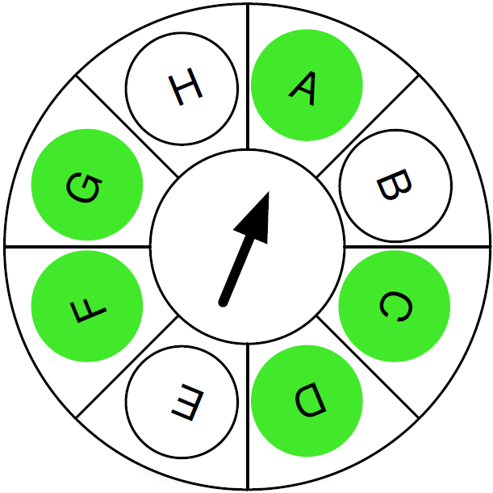
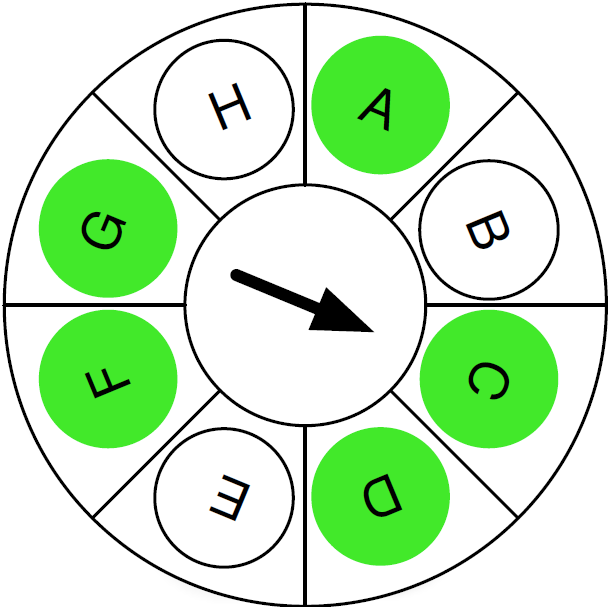
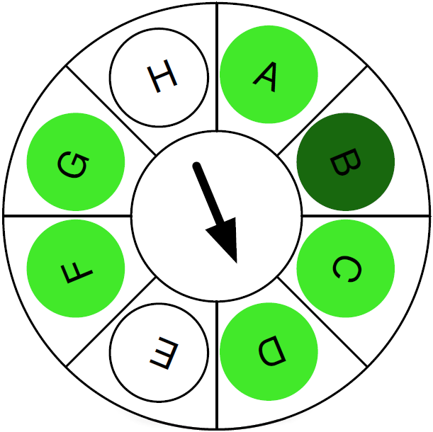
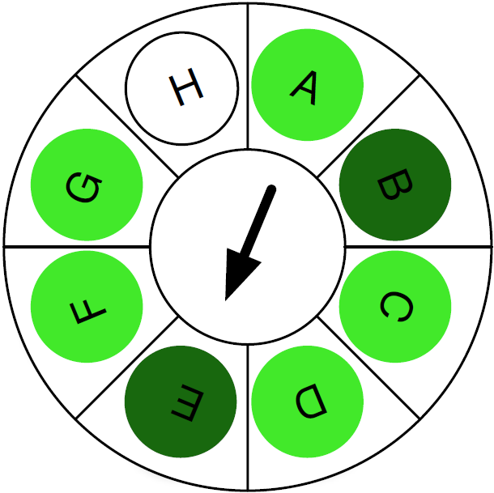
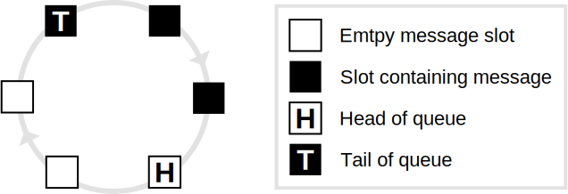
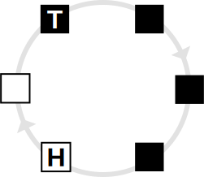
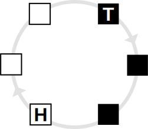

<!-- %title eChronos RTOS Manual: Rigel Variant -->
<!-- %version 0.2 -->
<!-- %docid Wq8tAN -->

# Introduction

This document provides the information that system designers and application developers require to successfully create reliable and efficient embedded applications with the eChronos real-time operating system.

The [Concepts] chapter presents the fundamental ideas and functionalities realized by the RTOS and how developers can harness them to successfully construct systems.

The [API Reference] chapter documents the details of the run-time programming interface that applications use to interact with the RTOS.

The [Configuration Reference] chapter details the interface to the build-time configuration of the RTOS that system designers use to tailor the RTOS to their applications.

Throughout this document, *eChronos RTOS* or *the RTOS* will refer specifically to the *Rigel* variant of the eChronos RTOS.

# Concepts

This chapter introduces the concepts that form the foundation of the RTOS.
Many of these concepts would be familiar to readers who have experience in other real-time operating systems.
However, this chapter does cover aspects that are specific to the RTOS and significant for constructing correct systems.

In addition to this documentation, RTOS training can provide a more hands-on, practical introduction to the RTOS.

## Overview

The eChronos RTOS facilitates the rapid development of reliable, high-performance embedded applications.
It allows developers to focus on the application logic by wrapping the complexities of low-level platform and system code in a comprehensive, easy-to-use operating-system API.
Since each application configures the RTOS to its specific requirements, this document refers to the combination of RTOS and application code simply as the *system*.

In terms of its functionality, the RTOS is a task-based operating system that multiplexes the available CPU time between tasks.
Since it is non-preemptive, tasks execute on the CPU until they voluntarily relinquish the CPU by calling an appropriate RTOS API function.
The RTOS API (see [API Reference]) gives tasks access to the objects that the RTOS provides.
They include [Interrupt Service Routines], [Signals], [Time and Timers], [Mutexes], and [Message Queues].

A distinctive feature of the RTOS is that these objects, including tasks, are defined and configured at build time (see [Configuration Reference]), not at run time.
This configuration defines, for example, the tasks and mutexes that exist in a system at compile and run time.
Static system configuration like this is typical for small embedded systems.
It avoids the need for dynamic memory allocation and permits a much higher degree of code optimization.
The [Configuration Reference] chapter describes the available configuration options for each type of object in the RTOS.

## Startup

The RTOS does not start automatically when a system boots.
Instead, the system is expected to start normally, as per the platform's conventions and C runtime environment.
The C runtime environment invokes the canonical `main` function without any involvement of the RTOS.
This allows the user to customize how the system is initialized before starting the RTOS.

The RTOS provides a [start] API that needs to be called to initialize the RTOS and begin its execution.
The [start] API never returns.
Any tasks that are marked as auto-start are automatically started by the RTOS.
All other tasks are initially in the blocked state, waiting to receive a start signal.
A start signal can be sent to a task via the [task_start] API.

There is no API to shut down or stop the RTOS once it has started.

## Error Handling

There are some rare cases in which the RTOS may detect a fatal error state.
Fatal errors include, for example, the fact that the timer component is unable to process a timer tick before another tick occurs.
How such error states are handled best depends to a large degree on the application and system requirements.
Therefore, the RTOS allows applications to customize the response to error states.

When the RTOS detects an error state, it calls the application-provided function [`fatal_error`].
The application can implement its preferred strategy to deal with error states this way, where typical approaches are to log the error state and reset the system.
The RTOS supplies a single [ErrorId] parameter to the application's [`fatal_error`] function that indicates the kind of error that occurred.

The RTOS relies on [`fatal_error`] to not return, so it must stop the system and prevent the RTOS and application from continuing to execute.
This also means that the [`fatal_error`] function must not use any RTOS APIs.

### Assertions

A particular instance of error states is when an assertion in the RTOS implementation fails.
There two kinds of such assertions:
API assertions and internal assertions.
Both kinds are optional and can be enabled or disabled in the system configuration (see [Error Handling Configuration]).

API assertions check a wide range of (but not all) requirements and preconditions that the RTOS API has regarding application run-time behavior.
For example, the [mutex_lock] API implementation can assert that the mutex ID that the application provides identifies a valid mutex.
All such assertions cover requirements and preconditions that are clearly documented.
It is good practice for applications to enable these assertions via the [`api_asserts`] configuration item for debugging and test builds.
It is recommended to disable them in release builds to avoid the code-size and execution-time costs they incur.

Internal assertions check a (relatively small) range of internal assumptions of the RTOS implementation that are not related to the application behavior.
These implementation-specific sanity checks are irrelevant to applications and primarily intended for testing and debugging the RTOS implementation itself.
Applications are free to enable them via the [`internal_asserts`] configuration item.
However, they provide no tangible benefit to applications and they do incur code-size and execution-time overhead.

## Tasks

As the core mechanism of the RTOS, tasks are the basic building blocks for structuring complex systems.
Tasks provide independent control flows that can, on the one hand, be easily understood, implemented, and maintained.
On the other hand, they interact with each other via the RTOS APIs to form a complete application and provide its full functionality.

### Task and System Structure

In general, a CPU executes a stream of instructions that modify internal state (registers and memory) and control external devices.
The challenge for an application developer is to work out which instructions should be executed to obtain the desired application behavior.

For systems with simple requirements this can be easily achieved with a single big-loop design.
However as the inherent complexity of requirements increases, a single big-loop becomes too complicated to effectively develop, reason about, or debug.

The diagram below shows an example of this big-loop design.
As more demands are placed on the system, the code in the *logic* part of the code becomes too complicated.

<table width="100%"><tr width="100%">
<td class="codebox" width="100%"><pre>void main(void)
{
    for (;;) {
        /*... logic A ...*/

        /*... logic B ...*/

        /*... logic C ...*/
    }
}</pre></td></tr></table>

There are multiple ways that a system designer could start to address this complexity.
The overarching design principle is separation of concerns, where logic that addresses different aspects of the system are separated in some manner to make the complexity more manageable.
One approach to decomposing a system is to structure the functionality so that rather than a single large loop, there are multiple smaller loops, each performing a cohesive set of actions.

The RTOS implements this abstraction by providing tasks.
Each task in the system executes its own loop, and the RTOS provides the underlying mechanism for switching the CPU from one task to another.

The diagram below shows three tasks, A, B and C, each with their own loop.
The logic for each of these should be simpler than the case where this logic is mixed in a single big loop.
The arrows show how each task executes independently on the underlying CPU.
The end of each arrow represents the point in time where the RTOS switches the CPU from running one task to running a different task.

<table width="100%"><tr width="100%">
<td width="33%" class="codebox"><pre>void task_a(void)
{
    for (;;) {
        /*... logic A ...*/
    }
}</pre></td>
<td width="33%" class="codebox"><pre>void task_b(void)
{
    for (;;) {
        /*... logic B ...*/
    }
}</pre></td>
<td width="33%" class="codebox"><pre>void task_c(void)
{
    for (;;) {
        /*... logic C ...*/
    }
}</pre></td>
</tr></table>

### Task Names

Each task in the system has a unique name chosen and configured by the system designer.
The name is an ASCII string[^task_names] and should describe the functionality of the task (also see the [`tasks/task/name`] configuration item).

Within the RTOS and the application implementation, task names translate to constants of type [TaskId].
Each task has a unique [TaskId] which is assigned automatically by the RTOS configuration tool.
The RTOS configuration tool generates a symbolic macro of the form [`TASK_ID_<name>`].
Application code should use this symbolic macro rather than directly using integer values to refer to tasks.

[^task_names]: There are some additional restrictions on valid names.
See the [Configuration Reference] section for more details.

### Task Functions

Each task in the system is configured with a function that serves as the entry point into the implementation of the given task's functionality.
The RTOS sets up each task such that when it is started, it begins its execution with this function.
Task functions are configured statically together with the other task properties (also see [`tasks/task/function`]).

For the RTOS to correctly call a task's function, it must have the type signature `void fn(void)`.
That is, it shall have no arguments because the RTOS does not supply any arguments to task functions.
Furthermore, it is an implementation error for a task function to return.
The effect of a task function returning is generally undefined, but it may result in a fatal error state (see [Error Handling]).

Although it is a less common system design, multiple tasks may share the same task function because they run on separate stacks.
However, such a setup requires particular care with regard to concurrent access to shared data structures and resources.

### Task Stacks

Each task in the system has its own unique stack.
Stacks are created and set up by the RTOS configuration and runtime environment, so a system designer's main concern with stacks is choosing an appropriate size.

Stacks are used for several purposes while an application runs:

- The primary user of a stack is the task code itself as it holds variables and return addresses during function calls.

- Additionally, when the RTOS performs a task switch away from a task, it saves that task's context (such as its register values) on its stack.

- Furthermore, [Interrupt Service Routines] use the stack of the task they interrupt.

The size of each stack is chosen by the system designer and configured statically and individually for each task (see the [`tasks/task/stack_size`] configuration item in the [Task Configuration] Section).
This size needs to be chosen carefully to ensure that there is sufficient space on the stack for all the kinds of stack usage listed above.

The effect of a stack overflow, when a task, the RTOS, or one or more ISRs require more than the available stack space, is generally undefined.
On some target platforms, the RTOS may support available hardware or software mechanisms to detect stack overflows.

### Task Switching

The task that is actively executing on the CPU is known as the current task (also see the [task_current] API).
To multiplex multiple tasks on a single CPU, the RTOS implements a context switching mechanism for changing the current task.
The task's context refers to all the state associated with the task but for which the underlying hardware can support only one copy at a time.
Specifically, the processor only supports a single program counter, stack pointer, and register state.
During a context switch, the RTOS saves the current task's state on the task's stack and then restores the state for the new current task.

The [Preemption] section provides more details on context switches, what can lead to them, and how to control them, which is an important aspect of constructing correct system behavior.

### Task States

An RTOS task can be in one of three primary states: current, runnable, or blocked.
Tasks within a system do no usually operate in isolation;
they interact with other tasks, devices, and the external environment.
When interacting with another entity, the RTOS provides mechanisms so that the task can wait until the other entity is ready, rather than the task needing to constantly poll the other entity.
When a task is waiting, it moves into the blocked state.
There are a number of RTOS operations that cause a task to block, such as waiting for a signal, locking a mutex, or sleeping.
When a task is in the blocked state, it is no longer current, so the RTOS must choose another runnable task to become the current task.
The blocked task unblocks and becomes runnable when the entity it is waiting on is ready, e.g., when a signal is delivered, a mutex is available, or a sleep duration has completed.

It is possible for the overall system to arrive in a state where all tasks are in the blocked state[^blocked_state].
In this situation, there is no current task and the system enters an idle mode.
When the system is in idle mode, interrupts may still occur and interrupt handlers are still processed.
Tasks may become runnable again when an interrupt handler unblocks a task via an interrupt event (see [Interrupt Events]).
If the platform supports it, the RTOS places the hardware into a low-power state while the system is idle.

[^blocked_state]: In a system designed to operate with low power consumption, it is desirable for this to be the case most of the time.

When there is more than one task in the runnable state, the RTOS must use the scheduling algorithm to determine the task that becomes current.
The scheduling algorithm is described in the [Scheduling Algorithm] section.

## Preemption

The RTOS is non-preemptive, which means that any context switch (see [Task Switching]) is actively caused by code that the current task executes.
In other words, once a task becomes the current task, it is in full control of the CPU, which it can relinquish only by actively causing a task switch.
While [Interrupt Service Routines] interrupt the current task, they immediately resume the same task and do not lead to task switches.

This also means that the system never performs a context switch asynchronously on its own or without an explicit action from the current task itself.
To put it another way, only tasks are active entities in a system, whereas the RTOS merely provides passive library code invoked by tasks.

For example, if any task enters an infinite loop such as `for (;;) ;`, the system effectively stops.
Once inside the loop, there is no call to an RTOS API that would lead to a task switch.
Therefore, to ensure that the system as a whole operates correctly, it is important that tasks perform context switches on a regular basis[^context_switch_regularity].

[^context_switch_regularity]: The exact definition of regular in this context depends on the system timing attributes.

For example, if there are any runnable tasks, it is important that they have the opportunity to become the current task.
When tasks are frequently interacting with other entities this is usually not a problem, as the task regularly block, providing the other runnable tasks with an opportunity to become the current task.
There are cases, however, when a task may wish to perform a long running operation without blocking.
In these cases, a task can perform a [yield] operation.
It makes the current task relinquish the CPU by performing a context switch, allowing another runnable task (selected by the [Scheduling Algorithm]) to become the current task.

## Scheduling Algorithm

The scheduling algorithm is an important component of the RTOS because it determines which one of the runnable tasks is selected for active execution.
For this purpose, the RTOS uses a round-robin algorithm without priorities.
The remainder of this section explains this algorithm in more detail.

The tasks in the system can be imagined as forming points on a clockface, with the clock hand pointing to the current task.
When a task blocks (or yields), the algorithm determines the next task by moving the hand forward until a runnable task is found.
In the diagram below, A is the current task and has just called the [yield] API, keeping A in the runnable state but requiring the scheduler to make a scheduling decision.
The algorithm firstly considers B, which is not runnable, and then considers C, which is runnable, so C is chosen.

The next diagram shows the state of the algorithm after choosing C.

While C is executing, task B may exit the blocked state and become runnable (e.g., via an interrupt).
If C now calls the [yield] API, the scheduling algorithm continues and chooses the next runnable task D.

As D was runnable before B became runnable, this behavior is what would be expected in most cases (and is the same as would happen in a FIFO algorithm).

The exact behavior of the scheduler becomes slightly more interesting, and possibly somewhat unexpected, if task E should now become runnable while D is executing.

If D now calls the [yield] API after E becomes runnable, then the scheduling algorithm picks E as the next current task.
In this case, E is chosen before the task B is chosen, even though it became runnable after B.
Not only is E selected before B, it is also selected before both F and G, which were already runnable.
This is different to how a FIFO based scheduling algorithm would operate.

For every revolution of the clock hand, each task has an opportunity to be selected.
This algorithm has the property that task execution always occurs in a predictable order.
For example, if A, B, and C are all runnable then the order of execution is always [A,B,C], and never, [B,A,C] or some other permutation.

The scheduling algorithm considers tasks in the same order in which they are defined in the system configuration (see [Task Configuration]).

## Signals

The signal mechanism is a flexible feature that helps tasks to interact with each other.
Signals are typically used for event notifications.
For example, a driver task can use a signal to notify a handler task whenever new data is available for processing.
Typically, the driver task would send a signal every time new data becomes available while the handler task would repeatedly wait to receive the signal and then process the data.

The signal mechanism typically blocks the handler task while it waits, and makes the task runnable again when it receives the exact signal it is waiting for.
Interrupt service routines can also send signals to a task via the interrupt event mechanism described in the [Interrupt Events] section.

Each task is associated with a set of pending signals.
When the system starts, this set is empty for all tasks, so there are no signals to receive for any task.
*Sending* a signal to a task effectively adds the given signal to the task's pending signal set.
Similarly, *receiving* a signal removes the given signal from the task's pending signal set (which, of course, requires the signal to be pending in the first place).

Tasks use signals via the following main APIs:

- [signal_send] sends a signal to another task, adding it to that task's pending signal set.

- [signal_peek] checks whether a signal is currently pending for the calling task, i.e., whether the specified signal is in the task's pending signal set.
[signal_peek] only performs the check without modifying the task's pending signals or blocking the task.

- [signal_poll] checks for and receives a signal, i.e., if the given signal is in the calling task's pending signal set, it removes it.

- [signal_wait] waits to receive a given signal, i.e., it blocks the calling task if necessary until the signal is pending and then receives it.

The above API functions also exist in versions that send or receive multiple signals in a single call.
When a task receives multiple signals, it is its responsibility to process each of those signals according to their semantics.

The RTOS does not predefine which signals exist in a system or what their meanings or semantics are.
System designers and applications are entirely free to define signals and to attach meaning to them.
They do so via the system configuration (see [Signal Configuration]).

The main property of each signal is its name, a so-called *label*, and applications always refer to signals via their names/labels.
For this purpose, the RTOS defines the constants [`SIGNAL_ID_<label>` and `SIGNAL_SET_<label>`] for each signal.
They refer to individual signals by their names and they can be used to construct signal sets from individual signals.
Although signals and signal sets are internally represented as numbers, applications neither need nor should make assumptions about those numeric values of signals.

### Signal Scopes

The RTOS represents signals and signal sets as bit masks of the [SignalSet] type.
With a growing number of signals, the [SignalSet] type may become too narrow to allocate distinct bits for all signals.
To mitigate this issue, the RTOS distinguishes between *global signals* and *task signals* which allows for optimizing the bit allocation in [SignalSet].

### Global vs. Task Signals

*Global signals* are signals which are handled in multiple different tasks whereas a *task signal* is handled only by a small fixed set of tasks known at configuration time.

A typical example of a global signal is one that a driver task sends to client tasks to inform them that the driver has new data available for those clients.
Since those clients can be any number of tasks that are not necessarily known at configuration time, the signal in question is best configured as a global one.

Conversely, a common instance of a task signal is a signal that client tasks send to a driver task to notify the driver of client data being available.
In this case, only a single fixed task is known to handle that signal.
Since that makes for a small fixed set of handler tasks (one in this case) known at configuration time, that signal is best [configured](#task-signal-configuration) as a task signal.

### Impact on Signal IDs

Task signals allow the RTOS to optimize the allocation of bits for signal IDs and sets.
In particular, it can use fewer bits for signals that are sent to disjoint task sets.
This may allow the application to configure and use a smaller, more efficient type for signal IDs and sets.

### Impact on System Configuration and Implementation

For application correctness, it is crucial that task signals are [configured](#task-signal-configuration) and used correctly.
The system configuration needs to be correct in the sense that each task signal is configured for the correct set of tasks, i.e., all tasks that receive and handle that signal.
The application implementation needs to be correct in the sense that each task signal is sent only to and handled only in the set of tasks configured in the system configuration.

For correctness, it is necessary and sufficient that the implementation does not send a task signal to a task outside the configured task set.
For efficiency, it is recommended to configure signals as task signals with as small task sets as possible.
It is always safe but potentially inefficient to configure all signals as global signals or to configure task signals with unnecessarily large task sets.

## Interrupt Service Routines

By default, the CPU executes code in *normal*, non-interrupted context and all RTOS tasks run in this context.
However, in response to interrupts, the CPU transitions into the interrupt context and executes a previously registered interrupt service routine (ISR).
When an ISR completes, the CPU returns to the normal context and continues to execute the previously interrupted code path.
The exact details of interrupt handling and how ISRs interact with the normal flow of execution heavily depend on the target platform.

RTOS tasks always execute in the normal context which can be interrupted by a hardware interrupt.
This allows the system to respond to hardware events with low latency.

It is the responsibility of the application to implement ISRs that adequately handle the interrupts that can occur.
The RTOS itself is generally not involved in handling interrupts, and leaves interrupt handling to applications.
Depending on the RTOS variant and target platform, the RTOS may or may not provide minimal wrappers that allow ISRs to be plain C functions.

ISRs may only use a very small subset of the RTOS API which consists mainly of raising [Interrupt Events].
To prevent inconsistencies from arising in the RTOS and system state, the majority of the RTOS API is not accessible to ISRs.
Therefore, applications are recommended to clearly differentiate between code executed in ISRs and task code.
Sharing code between the two modes of execution creates the risk of the shared code using RTOS APIs not available to ISRs.

### Stack Considerations

ISRs execute on the stack of the current task.
For this reason, each ISR should minimize its stack usage.
As the ISR may interrupt any task, each task must have a large enough stack to accommodate both its own usage and the maximum stack usage of any ISR.
On platforms that support and use nested interrupts, there needs to be sufficient stack space to accommodate a task's state plus all nestable ISRs.

### Data Consistency

As the system may interrupt a task at any time, it is important that the ISR modifies any data structures that it may share with tasks in a safe manner.
For example, if an ISR and a task both have code that increments a value (e.g., `i++`), it is possible for one of the increments to be lost.
Code such as `i++` is implemented with three separate instructions: read from memory, increment value, and write to memory.
If an interrupt happens between the read and write instructions, any changes to the variable that the ISR makes would be lost when the task's write instruction is executed.

One approach to solve this issue is to use instructions that can modify a memory location in a single operation.

### Disabling and Enabling Interrupts

Another option to ensure data consistency is to disable interrupts when updating shared data structures as in the following example:

    interrupt_disable();
    i++;
    interrupt_enable();

Tasks may freely disable and enable interrupts to block ISRs from interrupting tasks.
However, to ensure that RTOS APIs behave correctly, they must always be called with interrupts enabled.
Calling an RTOS API with interrupts disabled is an implementation error.

Another side effect of this approach is that it increases the latency between a hardware interrupt occurring and the corresponding ISR being executed.
When and for how long a task disables interrupts can heavily influence the timing of ISR processing and task activation.
Therefore, this aspect of application design and implementation requires particular care.

The RTOS itself ensures that ISRs execute with a low latency, and so the RTOS avoids disabling interrupts whenever possible.
As a result, an interrupt may occur during the execution of an RTOS API function, which means that the RTOS state may not be consistent when an ISR executes.
For this reason the ISRs must not call the regular RTOS APIs.
If an ISR were to call any regular RTOS function, it would corrupt RTOS state, and cause incorrect system behavior.

Of course, it is necessary for ISRs to interact with tasks.
To achieve this, [Interrupt Events] provide links between ISRs and tasks.

## Interrupt Events

Interrupt events provide the bridge between tasks and interrupt service routines.
The system can be configured with a number of interrupt events.
Each interrupt event is associated with a [TaskId] and [SignalSet][^signalset].
The [TaskId] and [SignalSet] association is usually done when the system is configured.
A task may choose to update this association at run-time using the [interrupt_event_task_set] API.

[^signalset]: See the [Signals] section for more details.

An interrupt service routine can call the [interrupt_event_raise] API to raise one of the interrupt events configured in the system.
The [interrupt_event_raise] API is carefully implemented using an atomic instruction to avoid any possible data races.
When an interrupt event is raised, it causes the associated signal set to be sent to the task associated with the interrupt event.
This provides a safe and efficient mechanism for interrupt service routines to interact with tasks.

## Time and Timers

It is not surprising that time is an important aspect of most real-time systems.
The RTOS provides a number of important interfaces for keeping track of time.
The RTOS tracks overall execution of the system, and additionally provides timer objects that allow tasks to schedule certain actions to happen after a specific duration of time.

### Ticks

All of the time-based interfaces in the RTOS are based around a tick concept.
The RTOS does not keep track of physical or wall-clock time;
instead it counts only ticks, so time and durations are expressed only in ticks in the RTOS API.
How much absolute physical time a tick represents is left to the system design.

The RTOS depends on the system to generate ticks, provide a suitable system tick driver, and inform the RTOS of each tick.
The system designer should ensure that the RTOS [timer_tick] API is called for each tick.
The [timer_tick] API is safe to call from an interrupt service routine.
A tick is not processed immediately but when the current task yields or blocks.

When a system tick is processed, the [timer_current_ticks] API value is incremented by one.
This allows tasks to keep track of the amount of time that the system has been running for, or shorter durations as they choose.

### Timers

Timers trigger certain actions, such as sending a signal, at a configurable time (expressed in ticks).
The [Timer Configuration] defines which timers exist in a system and what their properties are.

The main property of a timer is its tick value, which says how many ticks in the future the timer will expire.
When a system tick is processed, any enabled timer objects are decremented[^timer_decrement] by one.
When a timer is decremented to zero, the timer is said to expire.
The exact behavior that occurs when a timer expires depends on the configuration of the timer object.

[^timer_decrement]: The actual implementation does not decrement each timer, although it is an accurate description of the logical behavior.

- A timer object may be configured as a watchdog.
When a watchdog timer expires, it causes a fatal error to occur (see [Error Handling]).

- Alternatively, a timer may be configured to send, when it expires, a configurable set of signals to a configurable task.
If the timer is periodic, it automatically starts counting down again.

- Alternatively, a timer may be a one-shot timer, in which case it is disabled upon expiring, so it does not start counting down again.

### Timing Considerations

As timers are based on ticks, it is important to understand some of the limitations that this imposes.

Firstly, the best possible timing resolution is limited by the tick period.
If we assume a 40Hz tick (25ms period), then a desired period of 30ms must either be rounded down to 25ms or up to 50ms.

The second limiting factor comes into play because the RTOS is non-preemptive.
Ticks are processed only when a task yields or blocks, so there is a delay between the system calling the [timer_tick] API and the RTOS processing the tick, including timer handling.
To ensure that this delay is bounded, the RTOS requires tasks to not run for longer than a tick period.
For long running tasks this means that the task must yield at a higher frequency than the tick.
With this restriction in place, the delay for processing a tick is at most a tick period.

From a practical point of view this means that if the [timer_current_ticks] variable reads as 10, the actual elapsed time could be anywhere between 250ms and 300ms (more generally elapsed time is in the range `timer_current_ticks * tick_period` to `(timer_current_ticks + 2) * tick_period`).
To see how this can happen, consider the case where [timer_current_ticks] is 10.
If a task is scheduled and then the next tick occurs (which indicates 275ms of real-time has elapsed), the tick is not processed until the newly scheduled task yields (or blocks).
Since the task can execute for up to 25ms, it is possible for the elapsed time to reach (just under) 300ms, with the [timer_current_ticks] still reading as 10 (250ms).
Another consequence of this is that actual length of the time between two ticks being processed can be anywhere from zero to 2 times the tick period (e.g.: 0ms to 50ms in the current example).
If we continue the previous example and the task blocks at after executing for about 25ms, then the pending tick (which is now just under 25ms overdue) is processed.
Immediately after the pending tick is processed, the new tick happens, and may be processed immediately (if, for example, the RTOS is idle).

It is useful to consider the impact on actual timer objects.
First, assume a periodic timer, which is set up with a period of 10 ticks.
Using the same 25ms tick period as above, the time between consecutive timer expiries can range between 225ms and 275ms.
Only over long periods of time, the average time between consecutive expiries approaches the nominal 250ms value.
A similar level of imprecision is evident in a one-shot timer.
A 10-tick one-shot timer expires between 225ms and 275ms after it is set.
When a timer is required to expire after at least 250ms but not before then, it needs to be set to 11 ticks.

Note that the above latency considerations also apply to the value of the [timer_current_ticks] and [sleep] APIs.

## Mutexes

Mutexes provide a mechanism for controlling mutual exclusion among tasks.
Mutual exclusion can be used, for example, to ensure that only a single task operates on a data structure, device, or some other shared resource at any point in time.

Assume, for example, a system with a hardware block for CRC calculation.
Such a CRC engine might have two registers, `input`, and `result`, which are used to sequentially feed data to it and to retrieve the resulting CRC, respectively.
It could be represented by the following type and object for memory-mapped hardware access:

<pre>struct crc_engine {
    unsigned char input;
    unsigned char result;
};

struct crc_engine crc;</pre>

Its functionality could be made available to tasks by the following function:

<pre>unsigned char
crc_calculate(const unsigned char *const src,
              const unsigned char length) {
    unsigned char idx;
    for (idx = 0; idx != length; idx += 1) {
        crc.input = src[idx];
    }
    return crc.result;
}</pre>

It is safe for two (or more) tasks to call `crc_calculate()`.
The function does not cause any task switch, so it is guaranteed that a task enters and leaves the function without another task being scheduled in between.
Therefore, the CRC engine is only used by a single task at a time, calculating the result only from the input provided by that task.

However, if there is an explicit context switch involved, one task might start using the CRC engine while another, interrupted task has not yet completed its own use of it.
This would lead to an overlap of input values and therefore incorrect CRC results.

A typical example is a long-running iteration that yields (or causes a context switch through any other means):

<pre>[...]
for (idx = 0; idx != length; idx += 1) {
    crc.input = src[idx];
    yield();
}
[...]</pre>

Mutexes can help to prevent such consistency issues.
Used correctly, a mutex ensures that only a single task at a time can execute code paths like the above.

At any given time, a mutex is in exactly one of two possible states: available or acquired.
Initially, each mutex is available.
Only after a task A acquires it via the [mutex_lock] or [mutex_try_lock] APIs, the mutex is in the acquired state.
After task A has finished manipulating the shared resources, it uses the [mutex_unlock] API to put the mutex back into the available state.
This allows other tasks to acquire it:

<pre>unsigned char
crc_calculate(const unsigned char *const src,
              const unsigned char length) {
    unsigned char idx, result;
    mutex_lock(RTOS_MUTEX_ID_CRC);
    for (idx = 0; idx != length; idx += 1) {
        crc.input = src[idx];
        yield();
    }
    result = crc.result;
    mutex_unlock(RTOS_MUTEX_ID_CRC);
    return result;
}</pre>

The API guarantees that only a single task in the system can hold a mutex at a given time.
In other words, it is guaranteed that when any number of tasks attempt to acquire a mutex, only one of them succeeds.
When a task A has already acquired a mutex and another task B uses [mutex_lock] on the same mutex, the API blocks task B.
Only when task A releases the mutex, task B unblocks, acquires the mutex, and returns from its call to [mutex_lock].

It is an implementation error for a task to call [mutex_lock] on a mutex it has already acquired.
It is also an implementation error to call [mutex_unlock] on a mutex not acquired by the calling task (i.e., if the mutex is either not acquired by any task or acquired by a different task).

The [mutex_try_lock] API allows a task to avoid being blocked by always returning immediately.
If the mutex is already acquired by another task, the API returns immediately, indicating that the calling task has not acquired the mutex.

The system designer defines at configuration time which mutexes are available in a system.
The main property of a mutex is its name, such as `CRC` in the example above.
Therefore, the implementation refers to a mutex via its symbolic name [`MUTEX_ID_<name>`] that has the type [MutexId].
Applications must not make any assumptions about or rely on the numeric values that the configuration tool assigns to such symbolic names.

As with any other objects that are not interrupt events, mutexes and their related APIs can not be used by interrupt service routines.

## Message Queues

Message queues are a mechanism for transferring data between tasks.
They are concurrency safe, so they are guaranteed to always be in a consistent state when multiple tasks access them.
Applications can use them without the regard for synchronization or mutual exclusion that is otherwise necessary when accessing shared data structures.
The RTOS implementation of message queues provides this synchronization internally.

Message queues behave like first-in/first-out circular buffers.
Therefore, applications cannot access arbitrary messages in a queue.
Instead, the messages in a message queue are always ordered by age.

When an application puts a message in a message queue, the message is placed at the *head* of the queue.
This head of the queue is essentially the least recently used free message slot in the queue.
When retrieving a message from a queue, it is taken from the *tail* of the queue.
That is always the oldest, least recently added message in the queue.

A message queue with six slots and three messages, for example, is illustrated below:

After putting a message in the queue, it looks as follows:

And after the application has retrieved a message from the queue, it looks like this:

The behavior of a message queue also depends on whether it is empty or full, i.e., when zero or all slots contain messages.
Putting a message into a full queue (or retrieving a message from an empty queue) blocks the calling task until a free slot (or a message) is available.
The [Message Queue API] additionally provides non-blocking functions and time-out based functions.

Every message queue has a fixed number of message slots that all have the same fixed message size.
The number and size of slots are statically configured properties and cannot be changed at run time.

A message queue allocates the memory for all of its slots statically at build time.
Therefore, regardless of how many messages have been put into a queue at any given time, the queue always occupies the amount of memory necessary to hold its maximum capacity.
The put and get APIs copy the message contents to and from the slots, so message queues are better suited for shorter rather than for longer messages in terms of performance.

# API Reference

This chapter describes the runtime application programming interface (APIs) provided by the RTOS.

## Correct API Usage

The RTOS API design and implementation leave room for the application to use it incorrectly.
For example, there are generally no safeguards in the RTOS itself against the application supplying invalid task-ID values to API functions.
To achieve correct system behavior, it is the application's responsibility to use the RTOS API under the conditions and requirements documented here.

The RTOS implementation is able to detect some case of the application using the RTOS API incorrectly.
This feature needs to be enabled in the system configuration (see [`api_asserts`]).
When enabled, the RTOS checks some but not all cases of the API being used incorrectly.
If it detects such a case, it calls the `fatal_error` function.

## Types

The RTOS defines a number of *types* that are used in the API.
Most types are implemented as unsigned integers (e.g: `uint8_t`).
Unfortunately, the C language performs type checking only on the underlying types, but ignores any type definitions (`typedef`s).
It is recommended that a suitable static analysis or lint tool is used to ensure that application code is using the correct types when calling APIs.

## Constant Definitions

The RTOS defines a number of pre-processor macros as constants.
Ideally these would be made available as typed static constant variables, however some compilers do not always generate optimal code for that case, so a pre-processor macro is used instead.

## Functions vs. Macros

Some compilers do not support function inlining.
For performance or code space considerations, some APIs described in this chapter are implemented as function-like macros.
This is an implementation detail and the use of all APIs must conform to the formal function definitions provided in this chapter.

## Core API

### start

void start(void);

The [start] API initializes the RTOS, makes all tasks configured as auto-start runnable and then, based on the scheduling algorithm, chooses and starts executing the current task.
This function must be called from the system's main function.
This function does not return.

### task_start

void task_start(TaskId task);

The [task_start] API starts the specified task.
This API must be called only once for each task that is not automatically started by the RTOS.
This function is merely a convenience function for sending `SIGNAL_SET_START` to the function.

### yield

void yield(void);

The [yield] API causes a context switch to a runnable task in the system.
That task is determined by the scheduler.
If the current task is the only runnable task in the system, [yield] returns without a context switch.
Each task must yield (or block) at least once per timer period to ensure that ticks are correctly processed and that all tasks receive a share of execution time on the CPU.
When yielding (or blocking), any raised interrupt events are processed.

### sleep

void sleep(TicksRelative ticks);

The [sleep] API blocks the current task for the specified number of timer ticks.
After `ticks` timer ticks, the task becomes runnable again.
Note that that does not immediately make it the current task again.
See the [Time and Timers] section for further information on timing and scheduling considerations.

## Error Handling API

### ErrorId

An instance of this type refers to a specific RTOS error state.
When the RTOS detects an error state, it passes a value of type [ErrorId] to the [`fatal_error`] function, which the application needs to implement.
The RTOS implementation defines constants that identify all potential error states and the corresponding [ErrorId] values.
The names of these constants follow the pattern `ERROR_ID_<error-state>`.

## Task API

### TaskId

Instances of this type identify specific tasks.
The underlying type is an unsigned integer of a size large enough to represent all tasks[^task_id_type].
The [TaskId] should generally be treated as an opaque value.
Arithmetic operations should not be used on a [TaskId].

The application may assume that a [TaskId] is in the range [TASK_ID_ZERO] through [TASK_ID_MAX].
For example, if a per-task data structure is required, it is valid to use a fixed size array and index the array by using the [TaskId].
For iterating over such an array, it is valid use to increment an instance of [TaskId], however care must be taken to ensure the resulting value is in range.
[TaskId] instances can be tested for equality, however other logical operations (e.g., comparison) should not be used.
For all tasks in the system, the configuration tool creates a constant with the name `TASK_ID_<name>` that should be used in preference to raw values.

[^task_id_type]: This is normally a `uint8_t`.

### TASK_ID_ZERO

This constant has the type [TaskId] and represents the task with the numerically lowest task ID in the system.
This can be used in cases where application code wishes to iterate over all tasks in the system.

### TASK_ID_MAX

This constant has the type [TaskId] and represents the task with the numerically highest task ID in the system.
This can be used in cases where application code wishes to iterate over all tasks in the system.

### `TASK_ID_<name>`

These constants have the type [TaskId].
A constant is created for each task in the system, where `<name>` is the upper-case conversion of the task's name (see [Task Names]).

### task_current

TaskId task_current(void);

This function returns the task ID for the current task.

## Signal API

### SignalSet

A [SignalSet] holds multiple distinct signals (the maximum supported signals depends on the [`signalset_size`] configuration parameter).
The underlying type is an unsigned integer of the appropriate size.

### SignalId

A [SignalId] is an alias for the [SignalSet] type, but represents the special case where the set contains exactly one signal (i.e., it is a singleton set).

To test whether a signal set contains a signal, use the bitwise *and* operator.
For example, `SIGNAL_SET_ALL & SIGNAL_ID_<label>` always evaluates to `SIGNAL_ID_<label>` for all signals.
To construct a signal set from multiple signals, use the bitwise *or* operator.
For example, `SIGNAL_SET_EMPTY | SIGNAL_ID_<label>` always evaluates to `SIGNAL_ID_<label>` for all signals.

### SIGNAL_SET_EMPTY

[SIGNAL_SET_EMPTY] has the type [SignalSet] and represents an empty set.

### SIGNAL_SET_ALL

[SIGNAL_SET_ALL] has the type [SignalSet] and represents set containing all signals in the system.

### `SIGNAL_ID_<label>` and `SIGNAL_SET_<label>`

`SIGNAL_ID_<label>` has the type [SignalId].
`SIGNAL_SET_<label>` has the type [SignalSet].
Constants of this form are automatically generated for each signal label.
The `<label>` portion of the name is an upper-case conversion the signal label.

### signal_wait_set

SignalSet signal_wait_set(SignalSet requested_set);

This API makes a task wait for and receive a set of signals.
If none of the signals in `requested_set` is pending, the calling task blocks until at least one of them is pending.
When the API returns, it returns all of the task's pending signals that are in `requested_set` and atomically removes them from the pending signal set.
The returned signal set is guaranteed to not be empty and to only contain signals in the requested set.
Immediately after the API returns, it is guaranteed that none of the signals in `requested_set` are pending any more.

If a signal is available immediately (without needing to block), this API implicitly calls [yield] before returning to the user.

### signal_wait

void signal_wait(SignalId requested_signal);

This API behaves exactly as [signal_wait_set] for the singleton signal set `requested_signal`.
Since its only valid return value would be equivalent to `requested_signal`, it does not return a value.

### signal_poll_set

SignalSet signal_poll_set(SignalSet requested_set);

This API receives a set of signals without waiting for them to become pending.
When the API returns, it returns all the task's pending signals that are in `requested_set` and atomically removes them from the pending signal set.
The returned signal set is guaranteed to only contain signals in the requested set.
Immediately after the API returns, it is guaranteed that none of the signals in `requested_set` are pending any more.
If none of the requested signals are pending, the API returns [SIGNAL_SET_EMPTY].

This API does not implicitly call [yield].

### signal_poll

bool signal_poll(SignalId requested_signal);

This API behaves exactly as [signal_poll_set] for the singleton signal set `requested_signal`.
It returns true if the requested signal is pending and false otherwise.

### signal_peek_set

SignalSet signal_peek_set(SignalSet requested_set);

This API checks if a set of signals is currently pending without modifying the pending signals.
When the API returns, it returns all the task's pending signals that are in `requested_set`.
The returned signal set is guaranteed to only contain signals in the requested set.
When the API returns, it is guaranteed that all of the signals in the returned signal set are pending.
If none of the requested signals are pending, the API returns [SIGNAL_SET_EMPTY].

This API does not implicitly call [yield].

### signal_peek

bool signal_peek(SignalId requested_signal);

This API behaves exactly as [signal_peek_set] for the singleton signal set `requested_signal`.
It returns true if the requested signal is pending and false otherwise.

### signal_send_set

void signal_send_set(TaskId destination, SignalSet send_set);

This API adds the signal set `send_set` to the pending signal set of the task with the ID `destination`.
After this API returns, it is guaranteed that the destination task can successfully use the peek, poll, or wait APIs to check for and/or receive the signals in `send_set`.

The API does not implicitly call [yield].
The caller must explicitly yield if that is the intended behavior.

### signal_send

void signal_send(TaskId task, SignalId signal);

This API behaves exactly as [signal_send_set] for the singleton signal set `signal`.

## Interrupt Event API

### InterruptEventId

Instances of this type refer to specific interrupt events.
The underlying type is an unsigned integer of a size large enough to represent all interrupt events[^InterruptEventId_width].

[^InterruptEventId_width]: This is normally a `uint8_t`.

Also refer to the [Platform Interrupt Event API] section.

### `INTERRUPT_EVENT_ID_<name>`

These constants of type [InterruptEventId] are automatically generated at build time for each interrupt event in the system.
Note that `<name>` is the upper-case conversion of the interrupt event's name configured through [`interrupt_events/interrupt_event/name`].
Applications should treat the numeric values of these constants as opaque values and use them in preference to raw numeric values to refer to interrupt events.

## Platform Interrupt Event API

### interrupt_event_raise

void interrupt_event_raise(InterruptEventId event);

The `interrupt_event_raise` API raises the specified interrupt event.
This API must be called only from an interrupt service routine (not a task).
Raising an interrupt event causes the signal set associated with the interrupt event to be sent to the task associated with the interrupt event.
This and [timer_tick] are the only RTOS API functions that an interrupt service routine may call.

### interrupt_event_task_set

void interrupt_event_task_set(InterruptEventId interrupt_event_id, TaskId task_id);

This function configures at run time which task is signaled when the specified interrupt event is raised.
In some application scenarios, the static configuration via [`interrupt_events/interrupt_event/task`] is sufficient and does not need to be modified at run time.
In those cases, this function does not need to be called.
In other scenarios, it an interrupt event may need to be signaled to a dynamically changing set of tasks.
In those cases, this function allows the application to update this configuration setting at run time.

## Sleep API

### sleep

void sleep(TicksRelative ticks);

The [sleep] API blocks the current task for the specified number of timer ticks.
After `ticks` timer ticks, the task becomes runnable again.
Note that that does not immediately make it the current task again.
See the [Time and Timers] section for further information on timing and scheduling considerations.

## Timer API

### TimerId

A [TimerId] refers to a specific timer.
The underlying type is an unsigned integer of a size large enough to represent all timers[^TimerId_width].
The [TimerId] value should be treated as an opaque value.
For all timers in the system, the configuration tool creates a constant with the name `TIMER_ID_<name>` that should be used in preference to raw values.

[^TimerId_width]: This is normally a `uint8_t`.

### TicksAbsolute

The [TicksAbsolute] type is used to represent an absolute number of ticks.
It is a 32-bit unsigned integer that has a large enough range to represent the total number of ticks since system boot.
For a 40Hz (25ms period) tick, this can handle over 1,200 days worth of ticks.

### TicksRelative

The [TicksRelative] type is used to represent a number of ticks relative to a point in time.
It is a 16-bit unsigned integer.
Assuming a 40Hz tick this provides range for up to 27 minutes' worth of ticks.

### `TIMER_ID_<name>`

`TIMER_ID_<name>` has the type [TimerId].
A constant is created for each timer in the system.
Note that *name* is the upper-case conversion of the timer's name.

### timer_current_ticks

TicksAbsolute timer_current_ticks;

The value of this variable is the current global tick count in the system.
It directly reflects how many times the timer_tick API has been called since the system startup.

### timer_tick

void timer_tick(void);

This API is to be called to register a system tick with the RTOS.
It is usually triggered by a periodic, external event, such as an interrupt generated by a hardware timer.
It is safe to call this API directly from an interrupt service routine.

Note that the RTOS timer functionality directly depends on this API being called regularly.
The registered tick remains pending until the RTOS processes the tick (see [Timing Considerations]).

### timer_enable

void timer_enable(TimerId timer);

This API is called to start a timer.
The timer starts counting down from its configured reload value.
If the timer's reload value is zero, then the timer expires immediately (and performs its configured expiry behavior).

### timer_disable

void timer_disable(TimerId timer);

This API stops a timer.
The configured expiry action does not occur if the timer is disabled before it has expired.
Disabling a timer does not simply pause the timer;
if the timer is reenabled (with the [timer_enable] API), it starts counting from the configured reload value.

### timer_oneshot

void timer_oneshot(TimerId timer, TicksRelative timeout);

This API starts a timer in a one-shot manner.
When the timer expires, it does not automatically restart.
The timer expires after `timeout` number of ticks.

### timer_check_overflow

bool timer_check_overflow(TimerId timer);

This API returns true if a timer has overflowed.
A timer overflows if the signal it sends on expiry would be lost.
For example, if a task is expecting to receive signals from a periodic timer and does not receive them quickly enough, the timer is marked as having overflowed.
Calling the [timer_check_overflow] API clears the overflow mark if set.

### timer_remaining

TicksRelative timer_remaining(TimerId timer);

This API returns the number of ticks remaining before the specified timer expires.

### timer_reload_set

void timer_reload_set(TimerId timer, TicksRelative reload_value);

This API configures a timer's reload value.
The `reload` value is used to initialize the timer when it is enabled (or when it restarts in the case of a periodic timer).

### timer_signal_set

void timer_signal_set(TimerId timer, TaskId task, SignalSet sigset);

This API configures the timer so that on expiry it sends the set of signals `sigset` to the specified task.

### timer_error_set

void timer_error_set(TimerId timer, ErrorId error);

This API configures the timer so that on expiry it causes a fatal error to occur.
The specified `error` code is passed to the configured [`fatal_error`] function.

## Mutex API

### MutexId

An instance of this type refers to a specific mutex.
The underlying type is an unsigned integer of a size large enough to represent all mutexes[^MutexId_width].

[^MutexId_width]: This is normally a `uint8_t`.

### `MUTEX_ID_<name>`

These constants of type [MutexId] exist for all mutexes defined in the system configuration.
`<name>` is the upper-case conversion of the mutex's name.

Applications shall use the symbolic names [`MUTEX_ID_<name>`] to refer to mutexes wherever possible.
Applications shall not rely on the numeric value of a mutex ID.
Across two different RTOS and applications builds, the ID for the same mutex may have different numeric values.

### `MUTEX_ID_ZERO` and `MUTEX_ID_MAX`

The IDs of all mutexes are guaranteed to be a contiguous integer range between `MUTEX_ID_ZERO` and `MUTEX_ID_MAX`, inclusive.
Applications may iterate over all mutexes via `for (id = MUTEX_ID_ZERO; id <= MUTEX_ID_MAX; id += 1)`.
Also, they may associate information with mutexes, for example as follows:

<pre>unsigned int mutex_lock_count[1 + MUTEX_ID_MAX - MUTEX_ID_ZERO];
#define mutex_lock_and_count(ID)\
do {\
    mutex_lock(ID);\
    mutex_lock_count[(ID) - MUTEX_ID_ZERO] += 1;\
} while (0)</pre>

### mutex_lock

void mutex_lock(MutexId mutex);

This API acquires the specified mutex.
It returns only after it has acquired the mutex, which may be either immediately or after another task has released the mutex.
A task must release a mutex before acquiring it again.

If the mutex is in the *available* state, it transitions into the *acquired* state and the API returns immediately.

If the mutex is in the *acquired* state, the mutex state does not change, but the calling task blocks and a task switch occurs.
After the task unblocks and becomes the current task again, it attempts to acquire the mutex again in the same fashion until successful.

This API is guaranteed to return only after the calling task has transitioned successfully the mutex from the *available* into the *acquired* state.

This implies that a task cannot successfully acquire the same mutex twice without releasing it in between.
Attempting to do so effectively blocks the calling task indefinitely.

### mutex_try_lock

bool mutex_try_lock(MutexId mutex);

This API attempts to acquire the specified mutex.
It returns true if it successfully acquired the mutex and false if the mutex is already acquired by another task.

If the mutex is in the *available* state, it transitions into the *acquired* state and the API returns true immediately.

If the mutex is in the *acquired* state, the mutex state does not change and the API returns false immediately.

This API does not cause a task switch.

### mutex_unlock

void mutex_unlock(MutexId mutex);

This API releases the specified mutex so that other tasks can acquire it.
A task should not release a mutex that it has not previously acquired.

This API transitions a mutex into the *available* state, unblocks all blocked tasks that have called [mutex_lock] while it was in the *acquired* state, and returns.

This API does not cause a task switch.

### mutex_holder_is_current

bool mutex_holder_is_current(MutexId mutex);

This API returns whether the current task is the holder of the specified mutex at the time the API is called.

## Message Queue API

### MessageQueueId

An instance of this type refers to a specific message queue.
The underlying type is an unsigned integer of a size large enough to represent all message queues[^MessageQueueId_width].
The [MessageQueueId] should be treated as an opaque value.
For all message queues in the system, the configuration tool creates a constant with the name `MESSAGE_QUEUE_ID_<name>` that should be used in preference to raw values.

[^MessageQueueId_width]: This is normally a `uint8_t`.

### `MESSAGE_QUEUE_ID_<name>`

These constants of type [MessageQueueId] exist for each message queue defined in the system configuration (see [Message Queue Configuration]).
Note that `<name>` is the upper-case conversion of the message queue's name.

### message_queue_put

void message_queue_put(MessageQueueId message_queue, const void *message);

This function waits - if necessary - until the given message queue is not full and then adds a message to the queue.

- The `message_queue` ID is typically one of the [`MESSAGE_QUEUE_ID_<name>`] constants as it must refer to a valid message queue as defined in the system configuration.

- The `message` pointer must point to a valid memory region large enough to hold a message of the size with which the message queue is configured.

If the queue is full, the function blocks the calling task until another task removes a message from the queue.
When the queue is not full, the function copies the message contents pointed to by `message` to the head of the queue, which is the free slot that was least recently used.

### message_queue_try_put

bool message_queue_try_put(MessageQueueId message_queue, const void *message);

This function adds a message to a message queue only if it is not full.

- The `message_queue` ID is typically one of the [`MESSAGE_QUEUE_ID_<name>`] constants, as it must refer to a valid message queue as defined in the system configuration.

- The `message` pointer must point to a valid memory region large enough to hold a message of the size with which the message queue is configured.

If the queue is full, the function returns false immediately without blocking the calling task.
If the queue is not full, the function copies the message contents pointed to by `message` to the head of the queue, which is the free slot that was least recently used.
In this case, the function returns true.

### message_queue_put_timeout

bool message_queue_put_timeout(MessageQueueId message_queue, const void *message, TicksRelative timeout);

This function adds a message to a message queue, but in contrast to [message_queue_try_put], it waits only for a limited amount of time for a message slot to become available if the queue is full.

- The `message_queue` ID is typically one of the [`MESSAGE_QUEUE_ID_<name>`] constants as it must refer to a valid message queue as defined in the system configuration.

- The `message` pointer must point to a valid memory region large enough to hold a message of the size that the message queue is configured with.

- The `timeout` value expresses the maximum wait time in ticks;
see [Time and Timers] for more details on timing considerations.
The result of calling this function with a `timeout` value of 0 is undefined.

If the queue is full, the function blocks the calling task until either another task removes a message from the queue or `timeout` ticks elapse, whichever comes first.
When the queue is not full, the function copies the message contents pointed to by `message` to the head of the queue, which is the free slot that was least recently used.
The function returns true if it successfully put the message into the queue;
otherwise, it returns false.

Note the following corner case when the queue is full.
As described above, the calling task blocks and a time-out occurs if no message slots become available in the meantime.
However, due to scheduling, the calling task may not become the current task again immediately after the time-out.
Instead, other tasks may be scheduled between the time-out occurring and the calling task becoming active.
Those other tasks may retrieve messages from the same message queue, making message slots available.
By the time the calling task becomes active, it successfully puts the message into the queue and returns true.
As a consequence, the return value does not indicate whether or not a time-out occurred, but whether or not the message was successfully put into the queue.

### message_queue_get

void message_queue_get(MessageQueueId message_queue, void *message);

This function waits - if necessary - until the given message queue contains a message, and then retrieves that message.

- The `message_queue` ID is typically one of the [`MESSAGE_QUEUE_ID_<name>`] constants as it must refer to a valid message queue as defined in the system configuration.

- The `message` pointer must point to a valid memory region large enough to hold a message of the size that the message queue is configured with.

If the queue is empty, the function blocks the calling task until another task puts a message into the queue.
When the queue is not empty, the function copies the contents of the message at the tail of the queue, which is the message least recently put into the queue, to the memory location pointed to by `message`.
The function also removes the message from the queue and advances the queue tail so that the message cannot be retrieved a second time.

### message_queue_try_get

bool message_queue_try_get(MessageQueueId message_queue, void *message);

This function retrieves a message - if one is available - from a message queue.

- The `message_queue` ID is typically one of the [`MESSAGE_QUEUE_ID_<name>`] constants as it must refer to a valid message queue as defined in the system configuration.

- The `message` pointer must point to a valid memory region large enough to hold a message of the size that the message queue is configured with.

If the queue is empty, the function returns false immediately without blocking the calling task, without causing a task switch, and without modifying the state of the message queue.
If the queue is not empty, the function copies the contents of the message at the tail of the queue, which is the message least recently put into the queue, to the memory location pointed to by `message`.
The function also removes the message from the queue and advances the queue tail so that the message cannot be retrieved a second time.
In this case, the function returns true.

### message_queue_get_timeout

bool message_queue_get_timeout(MessageQueueId message_queue, void *message, TicksRelative timeout);

This function retrieves a message from a message queue, but in contrast to [message_queue_get], it waits only for a limited amount of time for a message to become available if the queue is empty.

- The `message_queue` ID is typically one of the [`MESSAGE_QUEUE_ID_<name>`] constants as it must refer to a valid message queue as defined in the system configuration.

- The `message` pointer must point to a valid memory region large enough to hold a message of the size that the message queue is configured with.

- The `timeout` value expresses the maximum wait time in ticks;
see [Time and Timers] for more details on timing considerations.
The result of calling this function with a `timeout` value of 0 is undefined.

If the queue is empty, the function blocks the calling task until either another task puts a message into the queue or `timeout` ticks elapse, whichever comes first.
When the queue is not empty, the function copies the contents of the message at the tail of the queue, which is the message least recently put into the queue, to the memory location pointed to by `message`.
The function also removes the message from the queue and advances the queue tail so that the message cannot be retrieved a second time.
The function returns true if it successfully retrieved a message from the queue;
otherwise, it returns false.

Note the following corner case when the queue is empty.
As described above, the calling task blocks and a time-out occurs if no messages become available in the meantime.
However, due to scheduling, the calling task may not become the current task again immediately after the time-out.
Instead, other tasks may be scheduled between the time-out occurring and the calling task becoming active.
Those other tasks may put messages into the same message queue, making them available for retrieval.
By the time the calling task becomes active, it successfully retrieves a message from the queue and returns true.
As a consequence, the return value does not indicate whether or not a time-out occurred but whether or not a message was successfully retrieved from the queue.

# Configuration Reference

This chapter provides a description of the available configuration items for the RTOS.
The RTOS is configured via the configuration tool called `prj`[^prj_manual].

[^prj_manual]: See `prj` manual for more details.

### Types

Configuration items have one of a number of different types.

- Boolean values are either true or false.

- Integers are numbers of arbitrary size specified in standard base-10 notation.

- C identifiers are strings that are valid identifiers in the C language (and generally refer to a function or variable that is available in the final system).

- Identifiers are strings used to name the different RTOS objects.
Identifiers must be lower-case string consisting of ASCII letters, digits and the underscore symbol.
Identifiers must start with a lower-case ASCII letter.

### Notation

Since the system configuration is specified in XML format, the configuration items form a hierarchy of elements.
For example, the list of tasks contains an entry for each task where in each entry several task-specific items are nested.

For clarity, this document refers to each item through a notation similar to [XPath](http://www.w3.org/TR/xpath).
For example, the *name* property of a task in the tasks component would be referred to as *tasks/task/name*.
It reflects not only the name of the property itself but also its location within the hierarchy of an entire system definition.

## RTOS Configuration

### `prefix`

In some cases the RTOS APIs may conflict with existing symbol or pre-processor macro names used in a system.
Therefore, the RTOS gives system designers the option to prefix all RTOS APIs to help avoid name-space conflicts.
The prefix must be an all lower-case, legal C identifier.
This is an optional configuration item that defaults to the empty string, i.e., no prefix.

The following examples are based on `prefix` having the value `rtos`.

* functions and variables: lower-case version of `prefix` plus an underscore, so [start] becomes `rtos_start` and [task_current] becomes `rtos_task_current`.

* types: CamelCase version of `prefix`, so [TaskId] becomes `RtosTaskId`.

* constants: upper-case version of `prefix` plus an underscore, so [TASK_ID_ZERO] becomes `RTOS_TASK_ID_ZERO`.

## Error Handling Configuration

### `api_asserts`

This configuration item is a boolean with a default of false.
When true, the RTOS checks the arguments passed to API functions at runtime for consistency.
For example, it checks whether the value of the [MutexId] argument of the [mutex_lock] API identifies a valid mutex.
If the check passes, the check has no effect on the behavior of the API.
If the check fails, the RTOS calls the [`fatal_error`] function.

### `internal_asserts`

This configuration item is a boolean with a default of false.
When true, the RTOS checks internal implementation state for consistency at runtime.
For example, it checks whether the [TaskId] instance identifying the current task is a valid task ID.
If the check passes, the check has no effect on the behavior of the RTOS.
If the check fails, the RTOS calls the [`fatal_error`] function.

### `fatal_error`

This configuration item is an optional C identifier with no default.
It must be the name of a C function which the application implements and the RTOS calls when a fatal error state occurs.
See Section [Error Handling] for more information.

## Task Configuration

### `tasks`

This configuration is a list of `task` configuration objects.
The configuration must include at least one task because a system without tasks cannot run application functionality.

### `tasks/task/name`

This configuration item specifies the task's name (also see [Task Names]).
Each task must have a unique name.
The name must be of an identifier type.
This is a mandatory configuration item with no default.

### `tasks/task/function`

This configuration item specifies the task's function (also see [Task Functions]).
It must be the name of a function that the application implements so that it is available at link time.
This is a mandatory configuration item with no default.

### `tasks/task/stack_size`

This configuration item specifies the task's stack size in bytes (also see [Task Stacks]).
It is a mandatory configuration item with no default.

### `tasks/task/start`

This boolean configuration option determines whether a task should automatically start when the RTOS is started.
If the task is not automatically started, it can be started using the [task_start] API.
This is an optional configuration item that defaults to false.
At least one task in the system should be configured with `start` as true, otherwise no task and hence no application functionality can ever start running in the system.

## Signal Configuration

### `signalset_size`

This specifies the size of signal sets in bits.
It should be 8, 16 or 32.
This is an optional configuration item that defaults to 8.

### `signal_labels`

The `signal_labels` configuration is an optional list of signal configuration objects that defaults to an empty list.

### `signal_labels/signal_label/name`

This configuration specifies the name of the signal label.
Signal label names must be unique.
The name must be of an identifier type.
This configuration is mandatory.

### `signal_labels/signal_label/global`

This optional boolean configuration item defaults to true.
If true, the given signal label is considered to refer a [global signal](#signal-scopes).
If true, the [`signal_labels/signal_label/tasks`] configuration item may not be used for the same signal label.
If false, the [`signal_labels/signal_label/tasks`] configuration item is required.

### `signal_labels/signal_label/tasks`

This optional list configuration item makes a signal a [task signal](#signal-scopes).
It defaults to the empty list.
If present, it needs to contain a non-empty set of `signal_labels/signal_label/tasks/task` configuration items that identify the tasks that the given signal is sent to.
If this list is present, the [`signal_labels/signal_label/global`] configuration item may not be set to true and is implicitly set to false.
If this configuration item is not present, the [`signal_labels/signal_label/global`] configuration item needs to be left at its default or explicitly set to true.

### `signal_labels/signal_label/tasks/task`

Each of these identifier configuration items needs to contain the name of a task that the signal `signal_label` is sent to and handled by.
See [Signal Scopes] for more information on global and task signals.

## Interrupt Event Configuration

### `interrupt_events`

The `interrupt_events` configuration is a list of interrupt event configuration objects.

### `interrupt_events/interrupt_event/name`

This configuration item specifies the interrupt event's name.
Each interrupt event must have a unique name.
The name must be of an identifier type.
This is a mandatory configuration item with no default.

### `interrupt_events/interrupt_event/task`

This configuration item specifies the task to which a signal set is sent when the interrupt event is raised.
This configuration item is optional.
If no task is set, raising the interrupt event causes a fatal error.
If the system designer does not set the task in the static configuration, it can be set at runtime using the [interrupt_event_task_set] API.

### `interrupt_events/interrupt_event/sig_set`

This configuration item specifies the signal set that is sent to the interrupt event's associated task.
A signal set is a list of one or more specified signal labels.
This configuration item is optional and defaults to the empty set.

## Timer Configuration

### `timers`

The `timers` configuration is a list of `timer` configuration objects.

### `timers/timer/name`

This configuration item specifies the timer's name.
Each timer must have a unique name.
The name must be of an identifier type.
This is a mandatory configuration item with no default.

### `timers/timer/enabled`

This boolean configuration item determines whether the timer is enabled when the system starts.
If it is true, the timer commences countdown on the very first tick.
This is an optional configuration item that defaults to false.
A timer can be enabled at runtime using the [timer_enable] API.

### `timers/timer/reload`

This configuration item specifies the timer's reload value.
The reload value is used to initialize the timer each time it is enabled.
The value is specified as a relative number of ticks.
The value must be presentable as a [TicksRelative] type.
This is an optional configuration item that defaults to zero.

### `timers/timer/task`

This configuration item specifies the task to which a signal set is sent when the timer expires.
This configuration item is optional.
If no task is set when the timer expires, a fatal error occurs.
If the system designer does not set the task in the static configuration, it can be set at runtime using the [timer_signal_set] API.

### `timers/timer/sig_set`

This configuration item specifies the signal set that is sent to the timer's associated task.
A signal set is a list of one or more specified signal labels.
This configuration item is optional and defaults to the empty set.

### `timers/timer/error`

This configuration item specifies the error code that is passed to the `fatal_error` function when the timer expires.
This configuration item is optional and defaults to zero.
This should not be set if a task is specified.

## Mutex Configuration

### `mutexes`

The `mutexes` configuration is a list of `mutex` configuration objects.
See the [Mutex Configuration] section for details on configuring each mutex.

### `mutexes/mutex/name`

This configuration item specifies the mutex's name.
Each mutex must have a unique name.
The name must be of an identifier type.
This is a mandatory configuration item with no default.

## Message Queue Configuration

### `message_queues`

The `message_queues` configuration item is a list of message queue configuration objects.

### `message_queues/message_queue/name`

This configuration item specifies the message queue's name.
Each message queue must have a unique name.
The name must be of an identifier type.
This is a mandatory configuration item with no default.

### `message_queues/message_queue/message_size`

This configuration item specifies the size in bytes of each message in the queue.
This is an optional configuration item with no default.
Either `message_size` or `message_type` needs to be specified for a message queue.

### `message_queues/message_queue/message_type`

This configuration item specifies the C type of each message in the queue from which the size of the messages is derived.
This is an optional configuration item with no default.
Either `message_size` or `message_type` needs to be specified for a message queue.

### `message_queues/message_queue/queue_length`

This configuration item specifies the maximum number of messages that the message queue can contain.
This is a mandatory configuration item with no default.

### Example

<pre>&lt;message_queues>
    &lt;message_queue>
        &lt;name>audio_samples&lt;/name>
        &lt;message_size>4&lt;/message_size>
        &lt;queue_length>32&lt;/queue_length>
    &lt;/message_queue>
&lt;/message_queues></pre>

